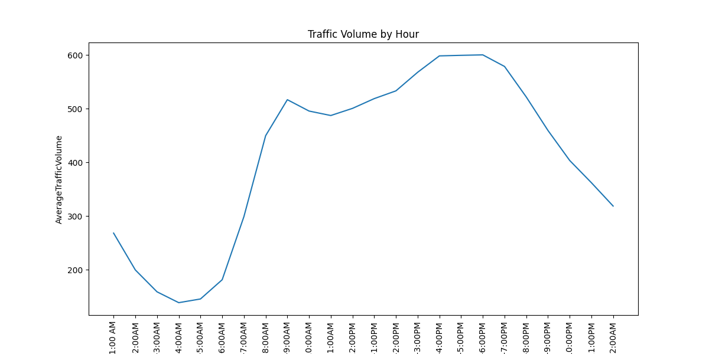
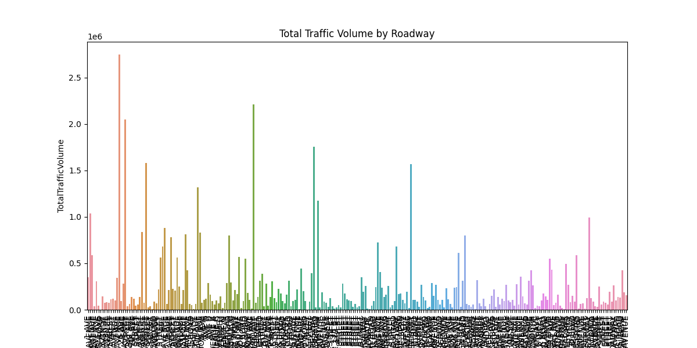
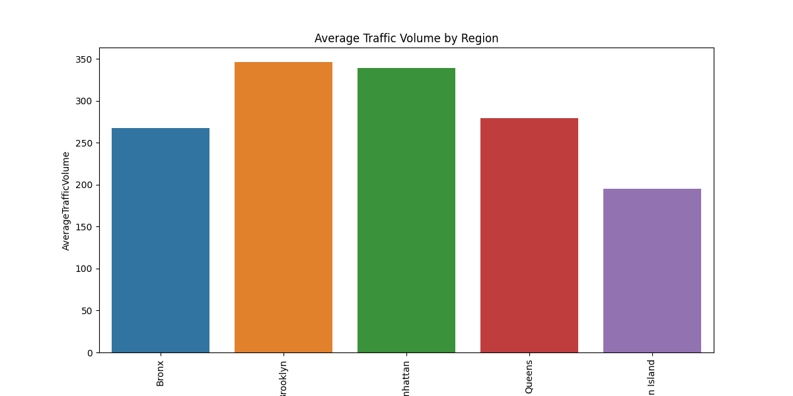
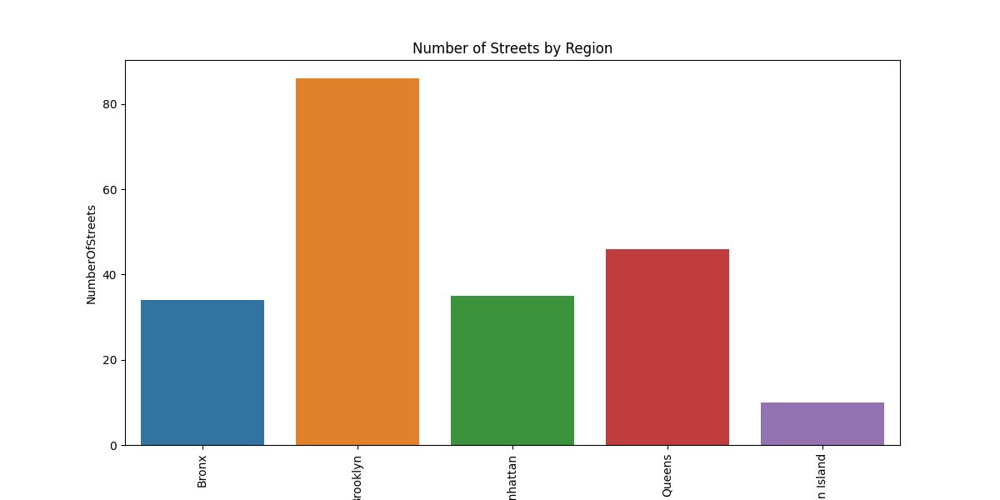
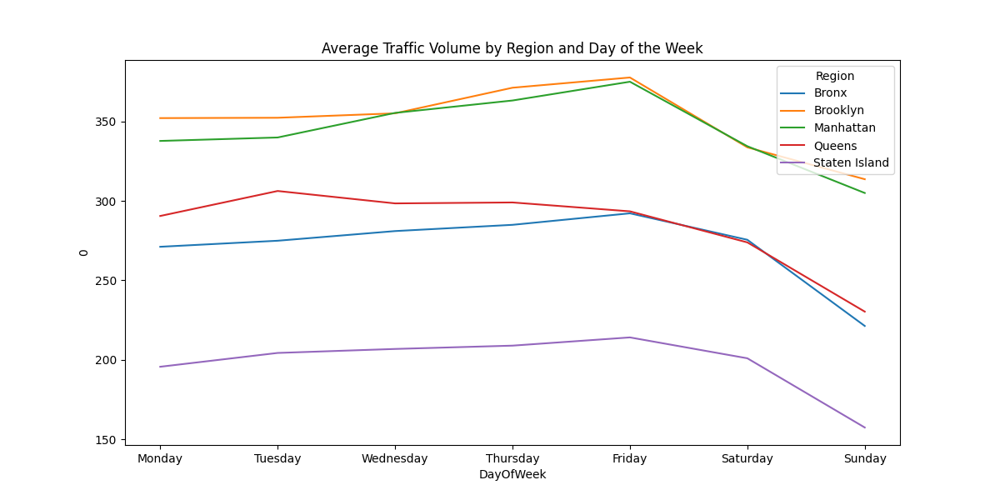
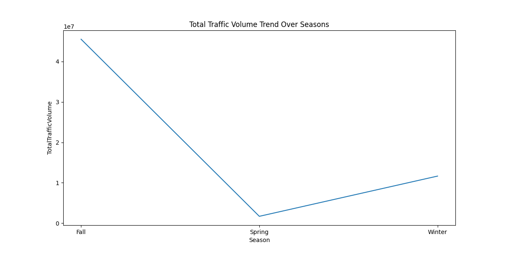
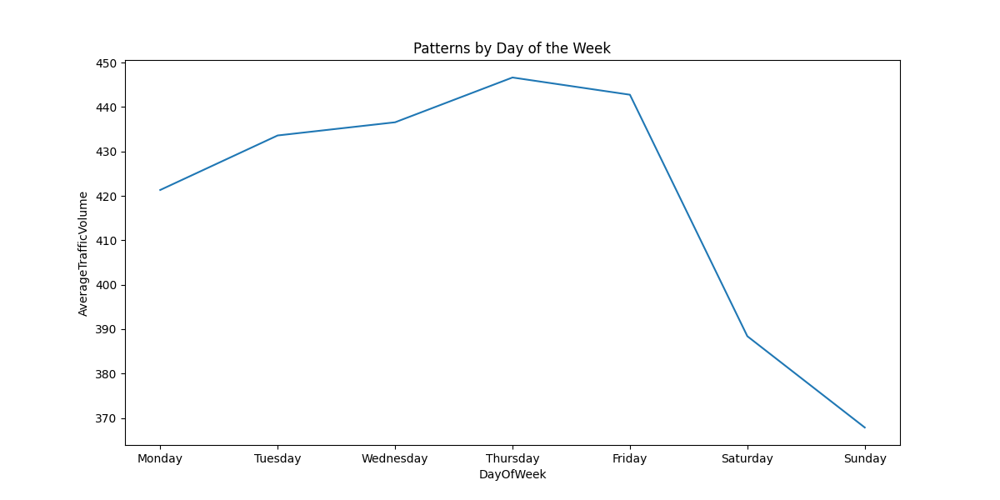

# Traffic Analysis Report

This repository provides a comprehensive analysis of traffic patterns, covering peak traffic times, regional distributions, roadway contributions, and visualizations for enhanced understanding.

---

## Key Findings
1. **Peak Traffic Hour:** 5:00-6:00 PM  
2. **Peak Traffic Day:** Thursday  
3. **Peak Traffic Location:** 2 AVENUE  

---

## Data Insights

### Traffic Patterns by Day of the Week
- **Day with Highest Average Traffic Volume:** Thursday
- **Average Traffic Volume by Day:**  
  | Day         | Average Traffic Volume |
  |-------------|-------------------------|
  | Monday      | 421.32                 |
  | Tuesday     | 433.59                 |
  | Wednesday   | 436.55                 |
  | Thursday    | 446.63                 |
  | Friday      | 442.75                 |
  | Saturday    | 388.41                 |
  | Sunday      | 367.87                 |

### Traffic Volume by Hour
- **Hour with Highest Traffic Volume:** 5:00-6:00 PM (600.31 average volume)
- **Hourly Traffic Distribution:**  
  

### Total Traffic Volume by Roadway
- **Roadway with Highest Traffic Volume:** 2 AVENUE (2,747,290 total volume)
- **Traffic Volume Distribution by Roadway:**  
  

### Regional Traffic Analysis
1. **Average Traffic Volume by Region:**  
     
   | Region         | Average Traffic Volume |
   |----------------|-------------------------|
   | Bronx          | 267.37                 |
   | Brooklyn       | 346.31                 |
   | Manhattan      | 339.57                 |
   | Queens         | 279.16                 |
   | Staten Island  | 195.36                 |

2. **Number of Streets by Region:**  
     
   | Region         | Number of Streets |
   |----------------|-------------------|
   | Bronx          | 34                |
   | Brooklyn       | 86                |
   | Manhattan      | 35                |
   | Queens         | 46                |
   | Staten Island  | 10                |

3. **Traffic Volume by Region and Day of the Week:**  
   

### Seasonal Traffic Volume Trends
- **Trend Analysis:**  
    
  | Season | Total Traffic Volume   |
  |--------|-------------------------|
  | Fall   | 45,514,480.14          |
  | Spring | 1,701,147.00           |
  | Winter | 11,654,540.00          |

---

## Visualizations

1. **Traffic Patterns by Day of the Week**  
   

2. **Traffic Volume by Hour**  
   

3. **Total Traffic Volume by Roadway**  
   

4. **Average Traffic Volume by Region**  
   

5. **Number of Streets by Region**  
   

6. **Traffic Volume by Region and Day of the Week**  
   

7. **Traffic Volume Trend Over Seasons**  
   

---

## Setup and Usage

1. Clone this repository:
   ```bash
   git clone https://github.com/yourusername/traffic-analysis-report.git
